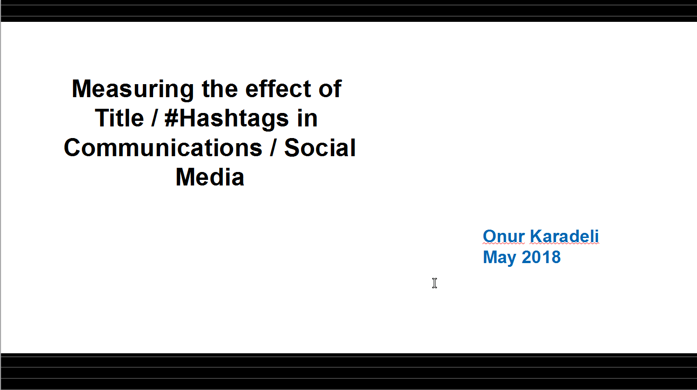

# WebMining - Hashtag Analyzer: The Effect of Wording in HashTag’s in Twitter Topics #

Scope: Twitter is a famous Social Media platform to convey ideas, news and events. The success of an idea to spread however is dependent on several factors. Most likely the most important factor is the poster who actually initiates the subject, how influencer he/she is, how many followers he/she have and so on. Another factor however is the tagging of topic however namely the HashTag(s)

Aim: This project is aimed to work on the public Twitter ecosystem and apply several text analytics approaches to fully understand the positive/negative impact of HashTag texting to the success of the topic.

 

